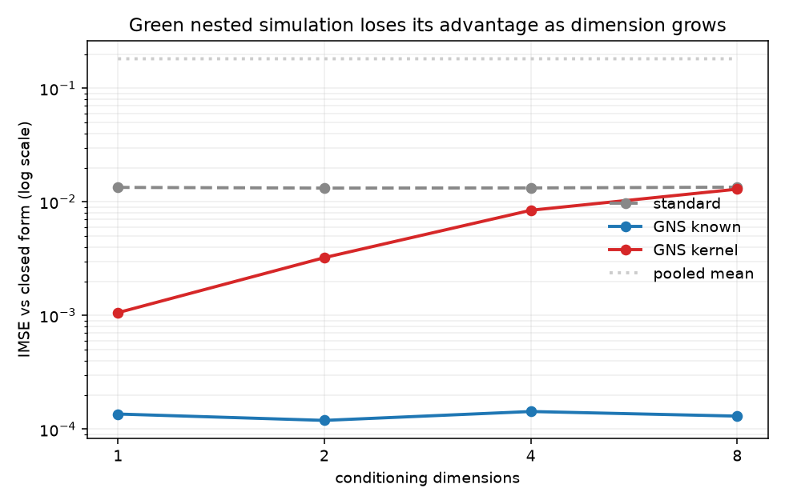

# Where green nested simulation stops paying for itself

Green nested simulation reuses Monte Carlo paths across scenarios by
reweighting them with a likelihood ratio, turning a per-scenario path budget
into the whole budget. It needs the conditional density `f`.

This reproduces the method's headline result, then measures what happens when
`f` has to be estimated instead — which is the situation in every domain that
does not come with a generative model attached.



```
  d     standard    GNS known GNS pairwise   GNS kernel  pooled mean   kernel ESS
  1       0.0134       0.0001       0.0038       0.0011       0.1816        826.8
  2       0.0132       0.0001       0.0038       0.0032       0.1816        244.2
  4       0.0133       0.0001       0.0066       0.0084       0.1816         40.9
  8       0.0135       0.0001       0.0057       0.0129       0.1816         20.3
```

Integrated mean squared error against a closed form, lower is better. Budget
4,000 paths, 40 trials, seeded.

**With `f` known, GNS is over 100× better than standard nested simulation.**
That is the paper's result, reproduced.

**Estimating `f` costs an order of magnitude in one dimension and the entire
advantage by eight**, where the kernel version and plain nested simulation are
the same number.

The last column says why. Effective sample size, `1/Σw²` on the normalised
weights, is how many of the 4,000 pooled draws the weighting is really
averaging for a given scenario. It falls 827 → 20 as dimension grows, and
**standard nested simulation gives each scenario exactly 20 paths**. So by
eight dimensions the reuse is averaging no more information than the naive
method it was meant to replace, and the two columns agreeing is a consequence
rather than a coincidence.

The weights have not gone uniform — that would collapse toward the pooled mean,
and it does not. They have gone *concentrated*: nearly all the weight lands on
a handful of near neighbours, and in eight dimensions being a near neighbour
overall says little about being near in the one dimension that matters.

## The convergence rate, which is the sharper result

IMSE against total budget at `d = 1`, with the log-log slope fitted underneath.
Theory says `-1`.

```
budget     standard    GNS known GNS pairwise   GNS kernel  pooled mean
  1000       0.0537       0.0004       0.0222       0.0024       0.1658
  2000       0.0254       0.0002       0.0130       0.0018       0.1657
  4000       0.0132       0.0001       0.0515       0.0011       0.1657
  8000       0.0066       0.0000       0.0054       0.0008       0.1657
 16000       0.0033       0.0000       0.0131       0.0004       0.1656
 slope        -1.00        -0.96        -0.28        -0.65        -0.00
```

**GNS with a known density hits `-0.96`.** The theorem, reproduced — not just
the magnitude at one budget but the rate.

**With the density estimated it converges at `-0.65`.** Estimating `f` does not
cost a constant factor, it *changes the exponent*, so the gap widens with
budget and more compute never closes it.

### What the rate is not

Hong, Juneja & Liu (2017), cited in the paper's own §1.2, give kernel smoothing
`O(Γ^-min{1, 4/(d+2)})`. Comparing that prediction against the measured slope
at each dimension does not go the way you would expect:

| d | Hong et al. predicts | measured |
| --- | --- | --- |
| 1 | 1.00 | 0.63 |
| 2 | 1.00 | 0.64 |
| 4 | 0.67 | 0.76 |
| 8 | 0.40 | **0.98** |

The predicted rate degrades with dimension. The measured one improves. The ESS
column explains it: by `d = 8` the weighting has collapsed to about 20
effective draws, so the estimator has degenerated into standard nested
simulation, which converges at 1 under this fixed-`M` allocation. **The level
degrades while the rate does not, because at high `d` it has stopped being a
kernel estimator.**

### And the bandwidth dominates

The exponent hardly matters — moving it between `d+2`, `d+4` and `2` shifts the
slope by under 0.03. The multiplier is another story, at `d = 1`:

| scale | slope | IMSE at 4,000 |
| --- | --- | --- |
| 0.25 | 0.80 | 0.0026 |
| 0.50 | 0.73 | 0.0016 |
| 1.00 | 0.63 | 0.0012 |
| 2.00 | 0.66 | 0.0046 |
| 4.00 | 0.45 | 0.0325 |

An order of magnitude in error and 0.35 in slope, from one untuned constant.
Note too that the scale giving the best *rate* (0.25) is not the one giving the
lowest *error* at this budget (1.00).

So the honest reading of the 0.63 above is that it cannot be separated from the
bandwidth being untuned — which is precisely the objection §1.2 raises against
kernel smoothing, that the bandwidth is "difficult and time-consuming to tune".
Everything here uses `scale = 1` throughout, chosen before any of this was
measured and left alone.

**Pairwise sits at `-0.28` and is not even monotone** — 0.0130 at budget 2,000,
0.0515 at 4,000. That non-monotonicity is the signature of the heavy-tailed
weight distribution the mixture denominator exists to prevent, and it is why
the paper insists on the mixture rather than a pairwise ratio.

**`pooled mean` is flat at `-0.00`.** It has no conditioning to refine, so it
cannot converge to the truth however large the budget. The control behaving
exactly as it must is what makes the other three columns readable.

## The tails, where the paper is candid and averages are not

IMSE grouped by distance from the centre of the mixture, `d = 1`:

```
  |kappa|     standard    GNS known GNS pairwise   GNS kernel  pooled mean
  central       0.0090       0.0000       0.0014       0.0002       0.0279
    inner       0.0113       0.0000       0.0020       0.0004       0.0405
    outer       0.0140       0.0001       0.0027       0.0007       0.0965
     tail       0.0207       0.0004       0.0155       0.0036       0.5558
```

Every estimator is worse in the tails, but they are not worse equally. Standard
nested simulation degrades about 2×, because each scenario keeps its own paths
wherever it sits. Both GNS variants degrade closer to 10–20×: scenarios far
from the centre of the mixture are exactly the ones with few well-weighted
paths to reuse.

That is the paper's own stated trade, confirmed independently. It matters
because a single averaged IMSE hides it, and the tails are where VaR and
capital requirements are read.

## Why this is the interesting number

The obvious question about applying GNS outside its home domain is "can you do
it without `f`?" That has a one-line answer: yes, you replace the likelihood
ratio with kernel similarity, and you are now doing kernel regression with a
bandwidth problem.

The useful question is **where the crossover sits** — the dimension at which
the cost of estimating the density exceeds what the reuse gains. Here it falls
between four and eight for a budget of 4,000, and it should move with budget,
bandwidth rule, and how much of the conditioning is actually informative.

Nobody has to find that crossover in the original setting, because Lee–Carter
hands you a closed-form normal.

The mechanism is ordinary curse of dimensionality, but it bites somewhere
specific: the mixture denominator `g = (1/M) Σ f(·|κᵢ)` is what keeps the
likelihood ratio from exploding between distant scenarios, and the mixture
denominator is exactly what cannot be estimated reliably in moderate dimension.
The variance control and the dimensionality problem are not two limitations.
They are one limitation seen from two sides.

## The setup

Deliberately the paper's own K-call case, so the reproduction is checkable:

- A risk factor following a random walk with drift, `κ' = κ + μ + σZ`, so the
  conditional density is a closed-form normal.
- A call-style payoff at maturity, `H(x) = max(x − K, 0)`.
- The target is `V(κ) = E[H | κ]` across 200 outer scenarios.
- `V` has an exact solution — Bachelier's formula — so error is **measured, not
  estimated**. The analytic value is itself checked against 2 million
  brute-force draws in the tests, because an IMSE computed against a wrong
  closed form would be worthless.

One addition: the conditioning state is embedded in `d` dimensions of which
only the first drives the payoff. That is the situation you are in whenever you
have features and cannot tell which of them matter — you can't drop the
irrelevant ones, because you don't know which they are.

Four estimators:

| | what it does |
| --- | --- |
| `standard` | classic nested simulation — each scenario keeps only its own paths |
| `GNS known` | reweight by `f(x\|κ)/g(x)`, self-normalised, mixture denominator |
| `GNS kernel` | same, with the ratio replaced by kernel similarity over the state |
| `pooled mean` | ignore the conditioning entirely — the floor |

`standard` and `GNS known` never read the conditioning features, so their
columns are flat in `d`. That is the control: it shows the movement in the
`GNS kernel` column is dimension doing it, not the simulation drifting.

## Running it

```bash
python -m venv .venv && source .venv/bin/activate
pip install -r requirements.txt

python main.py            # prints the table
python main.py --plot     # also writes imse.png
pytest                    # 8 tests
```

numpy, scipy, matplotlib. No data files, no network.

## Reference

Feng, B. M., Li, Z., & Zhou, J. (2022). *Green nested simulation via likelihood
ratio: Applications to longevity risk management.* Insurance: Mathematics and
Economics, 106, 285–301.

The method: pool the inner paths and reweight rather than resimulate; use a
mixture sampling density rather than a pairwise ratio, so weights stay finite
between distant scenarios; self-normalise, which is biased in finite samples
but consistent and much lower variance; and under a Markov risk factor
telescope the product of density ratios down to the single step after the
horizon. Unbiased, `O(Γ⁻¹)` CLT, 200×–4,000× lower IMSE than the Taylor-style
approximations it replaces — whose bias does not shrink with budget.

## Where this came from

It fell out of asking whether the method could estimate conditional expected
returns in a stock signal desk
([lp-stock-signals](https://github.com/Matr1xOw/lp-stock-signals)). It cannot,
and the arithmetic above is why: eight conditioning features and a few thousand
samples put you at the right-hand end of that table. Written up there in
`docs/green-simulation.md`.
